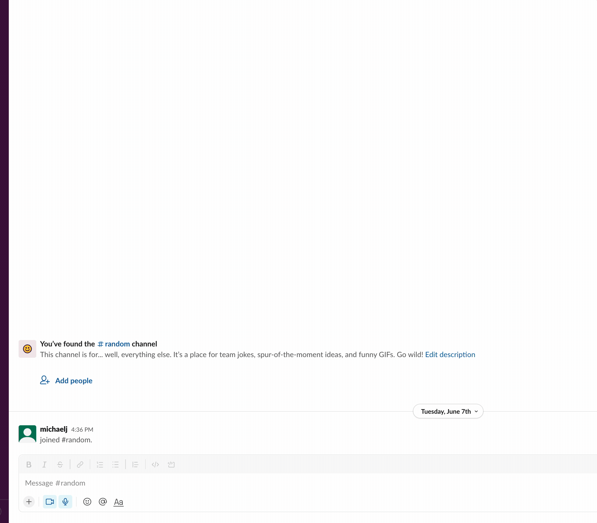
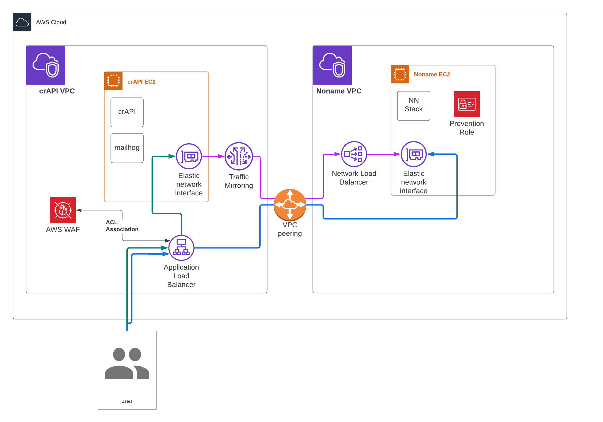

# DO NOT RUN THIS TERRAFORM DIRECTLY - MAKE USE OF THE SLACK BOT

This repository contains all assets need to spin up the Noname Workshop. This should NOT be executed directly, and instead `workflow_dispatch` is used in order to initiate via the Slack integration.

## Launching the Workshop

1. Go to slack
2. Navigate to the `Noname Workshop Automation` app
3. Click the `Create Workshop` button
4. Fill out form
5. Wait for bot to message you that environment is ready

To track spin up progress, SSH into noname server by clicking "Connect" on the EC2 instance and run:

`tail -f /var/log/syslog | grep cloud-init`

** Note: Instance do not set up to allow SSH from anywhere EXCEPT the AWS web shell. Do not enable SSH from anywhere else.**

## Noname Platform

The platform has the following users created automatically:
* `noname-su@nonamesecurity.com`
* `{yourUsername}@nonamesecurity.com`
* any users you added to the participants section...

Baseline scripts are automatically executed from the Noname server. Scripts are located at `/opt/noname/baseline-script`

## crAPI

crAPI is installed using `docker compose`. Compose file located at `/opt/crapi`

## Running the Workshop

When the platform launches, baselining and clustering will automatically occur. Issues are set to hide by default, so be sure to mark them as visible. Once baselining completes, you can generate issues.

Guides:

https://{{customer-name}}.nnsworkshop.com/pre-work

https://{{customer-name}}.nnsworkshop.com/hands-on-guide

### Generating Issues via Postman

1. Download Postman collection from https://{{customer-name}}.nnsworkshop.com/postman-collection
1. Load collections into Postman
2. Update globals environments with actual URL to crAPI
3. Click the three dots on the collection and choose run collection.

### Prevention

The platform automatically creats an AWS prevention integration by creating a WAF ACL and applying it to the ALB which is acts as proxy for the app server. Keep in mind that anyone you add to the platform as admin will be able to affect this integration tile (they won't be able to create a new WAF or disassociate the current WAF, but the paltform will let them delete the integration which disables the block user function), so ensure participants know that the integrations page is off-limits.

### Workshop Architecture

___________________

## Created Assets

* AppServer VPC
* AppServer subnet1
* AppServer subnet2
* AppServer route table
* AppServer internet gateway
* AppServer security group, allows HTTP inbound and SSH (from the IP address of whomever is executing the terraform)
* AppServer EC2
* AppServer ENI
* AppServer Application Load Balancer
* AppServer WAF ACL
* AppServer WAF IPv4 IP Set
* AppServer WAF IPv6 IP Set
* AppServer WAF prevention rule group
* Noname VPC
* Noname subnet
* Noname route table
* Noname internet gateway
* Noname security group, allows HTTPS inbound, 4789 from AppServer CIDR, SSH (from IP address of whomever is execute the terraform)
* Noname EC2
* Noname ENI
* VPC peering, AppServer VPC <-> Noname VPC
* Target Group with Noname EC2
* NLB, using target group with Noname
* Traffic mirroring target, source is crAPI ENI (VXLAN matches Noname integration entry to ensure source lines up)
* Traffic mirroring filter
* Traffic mirroring session
