author: Michael Jones
summary: This Workshop walks you through the Noname API Security Workshop in a hands-on, guided way.
id: guide
categories: workshop
environments: web
status: published
feedback link: https://forms.gle/bHiu6PEi4Cf1A35x9

# Noname API Security Workshop

## Explore your Noname Platform

### Overview Page

Explore the Noname overview page, navigate to it by clicking the noname icon in the top left. The overview page shows you a summary of issues by:

* Severity level: The severity level is a function of several factors that determine the overall risk to the API service based on issues discovered with that service. These could include misconfigurations, anomalies, and other relevant attributes. Click on a severity level to see a filtered list of all issues at that level.

* Module: Data, Posture, Runtime are three modules related to the post-production application lifecycle that Noname addresses. A list of issues for each module can be found lower in the overview page, or by clicking on a module.

* OWASP Top 10 API: A count of issues related to OWASP vulnerabilities. Click on any OWASP entry to filter on the specific issues for that entry. _Note that this workshop will focus on specific Top 10 API vulnerabilities, namely the #1 entry - Broken Object Level Authorization, or BOLA.

<aside class="negative">If you select a predefined, or custom GROUP on the left side then the page will filter all results based on APIs that are part of that group.</aside>

### Issues Page

Explore the issues page. As was seen in the Overview page earlier, issues have an associated risk level (high, medium, low) and module (runtime, posture, data). Issues are made up of anomalies and misconfigurations detected within the environment(s). OWASP Top 10 API tags and attacker identifiers are shown with each issue.

Filters can be applied to the list of issues, which can be saved for later viewing. Columns can be shown or removed, and used for custom group views. You can also search issues using the search box.

<aside class="negative">If you select a predefined, or custom GROUP on the left side then the page will filter all results based on APIs that are part of that group.</aside>

Click on an issue to view the details of that issue to include forensic "evidence" related to the issue. You can also comment on that issue, share that issue, download the issue details, take actions on that issue (depending on the workflow integrations you've enabled), view the attacker information (and other corresponding attacker issues), and ultimately, block that attacker. Blocks are tied to active integrations and will block based on the attacker's IP address, payload header, cookie and/or user token/identifier.

The issue details contain information involving Impact and includes Remediation Steps.

### Attackers Page

Explore the attackers page. As was seen in the issues page earlier, attackers have an associated IP address, header, cookie or user token/identifier that can be used to block that attacker based on the integrations you've enabled. Each entry will show how many issues are related to that attacker.

Columns can be shown or removed, and used for custom group views. You can also search Attackers using the search box.


<aside class="negative">If you select a predefined, or custom GROUP on the left side then the page will filter all results based on APIs that are part of that group.</aside>

Click on an attacker and view the detailed issues that are associated with that user/IP. Note that you can block an attacker from the details page.

### Inventory Page

Now navigate to the Inventory tab at the top of the page.

### Stats Page

Explore the stats page to get an overview of the number and type of APIs, and data found within those APIs based on classification and tags. You can also drill into APIs based on their authentication or classification types.

<aside class="negative">If you select a predefined, or custom GROUP on the left side then the page will filter all results based on APIs that are part of that group. This can be opened with the arrow on the left side of the page.</aside>

### APIs Page

Explore the APIs that were discovered in your environment. This list contains the host, method, and path of each API including other attributes. APIs can be filtered based on one or more attributes. To filter these APIs select the "Filters" button on the right side of the table. As an example, try filtering on all APIs that come from a specific traffic source integration, that are internet-facing, and have no authentication. Take a look at the datatypes within the request and response fields.

Filters can be applied to the inventory of APIs, which can be saved for later viewing. Columns can be shown or removed, and used for custom group views. You can also search APIs using the search box.

<aside class="negative">If you select a predefined, or custom GROUP on the left side then the page will filter all results based on APIs that are part of that group. This will overwrite any filters you have currently set.</aside>

Click on an API to view the details of that API.

<aside class="positive">The APIs that we will be interacting with as part of this workshop are the following:

/workshop/api/shop/orders (mechanics shop)

/identity/api/v2/vehicle/<guid>/location (your vehicle's geo-location)

/community/api/v2/community/posts/recent (car community forum)</aside>

### Changes Page

Explore the changes page. This page shows any deltas that were found within your environment. They include new APIs, fields, datatypes, and headers that are identified based on previous knowledge of the environment.

Filters can be applied to the list of API Changes, which can be saved for later viewing. Columns can be shown or removed, and used for custom group views. You can also search API Changes using the search box.

<aside class="negative">If you select a predefined, or custom GROUP on the left side then the page will filter all results based on APIs that are part of that group. This will overwrite any filters you have currently set.</aside>

Click on a change entry and view the details associated with that change. There is a link to the actual API in the details page. The schema for that API is shown in OpenAPI Specification format. If you are familiar with GIT notation and color coding, you'll be familiar with the green highlights (added) and red highlights (removed) entries.

### DataTypes Page

Explore the Datatypes page. This page shows all datatypes that were identified within the APIs. Datatypes are based on regex patterns that are included out-of-the-box (IP addresses, credit card numbers, social security numbers, etc.) or custom defined by users.

Filters can be applied to the list of issues, which can be saved for later viewing. Columns can be shown or removed, and used for custom group views. You can also search Datatypes using the search box.

<aside class="negative">If you select a predefined, or custom GROUP on the left side then the page will filter all results based on APIs that are part of that group. This will overwrite any filters you have currently set.</aside>

Click on a datatype to view all of the APIs that the datatype was seen within. Note that this takes you back to the APIs page but automatically applies a filter with the datatype you clicked on. Datatypes can be grouped together with "tags'' for more flexibility with alerting and auditing (DLP). There are tags that come standard out-of-the-box (sensitive, PCI, PII, credentials, etc.) or custom ones can be added by users. Tags that come standard with the platform are tied to algorithms that calculate risk levels associated with assets and issues.

Click on datatypes and the Manage button. Notice that the screen on the left pane view changes now that you've automatically navigated to the Settings section (denoted by the highlighted gear on the top right section of the page). Here you can either create a data policy (DLP), or a new datatype and/or data tag.

### Create a Custom DataType, Tag, and Policy

#### Custom DataType and Tag

1. Click on the `Create DataType` button and enter `firstname+lastinitial-dt` as the data type name. Eg: `michaelj-dt`

2. Choose a TAG

3. Set the FILTER by FIELD NAME regex to `.*`

4. Select `+ Add Filter by Field Value` button and set the logic to `AND`

5. Set the `Filter by Field Value` regex to a random word that isn't part of the email address you registered with; example: `.*pineapplejuice.*`

6. Optionally Select `Obfuscate datatype`

7. Click `Save`

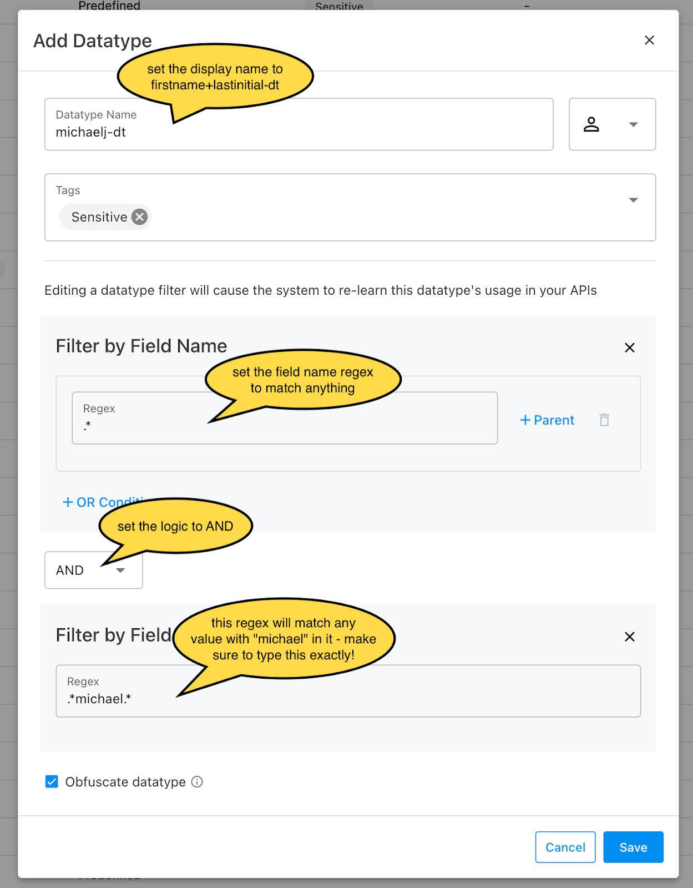

#### Custom Policy

1. Click on the `Data Policies` button and `Create Data Policy`

2. Enter a policy name and choose a severity

3. Select the `root` group so that all APIs will have this data policy applied to it

4. Scroll down to `Conditions` and select the custom datatype you previously defined. Select `Both` in order to apply the policy to both requests and responses

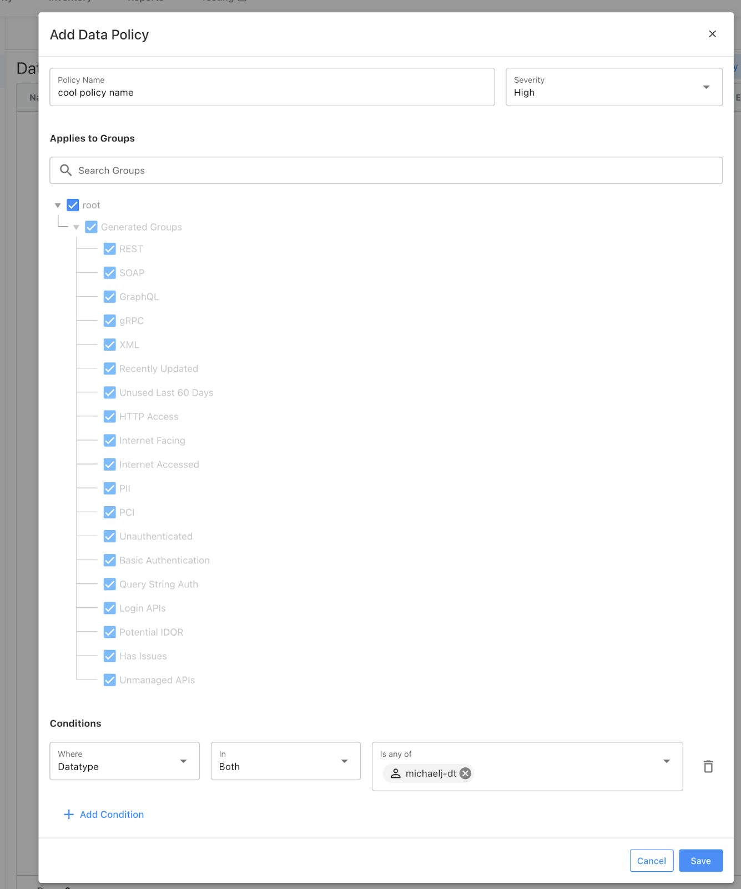

## Explore and Interact with the crAPI Web Interface

### crAPI Overview

The Completely Ridiculous API (crAPI) service was spearheaded by OWASP themselves with help from community contributors so as to help us understand the ten most critical API security risks from their Top 10 API list. crAPI is vulnerable by design, and we like it because it was not built by Noname, so it's as unbiased as it gets as far as vulnerabilities that matter.

Explore the github page for the crAPI web service:

[https://github.com/OWASP/crAPI](https://github.com/OWASP/crAPI)

Explore the challenges that are a part of the crAPI web and API services:

[https://github.com/OWASP/crAPI/blob/develop/docs/challenges.md](https://github.com/OWASP/crAPI/blob/develop/docs/challenges.md)

<aside class="negative">For the purposes of this workshop, we will focus on challenge #1 aligned with the OWASP #1 BOLA vulnerability. Time permitting, we may cover challenge #9 aligned with the OWASP Mass Assignment vulnerability.</aside>

### Explore the crAPI Website

1. Explore the dashboard page

<aside class="positive">Note the embedded google map showing the location of your vehicle.</aside>

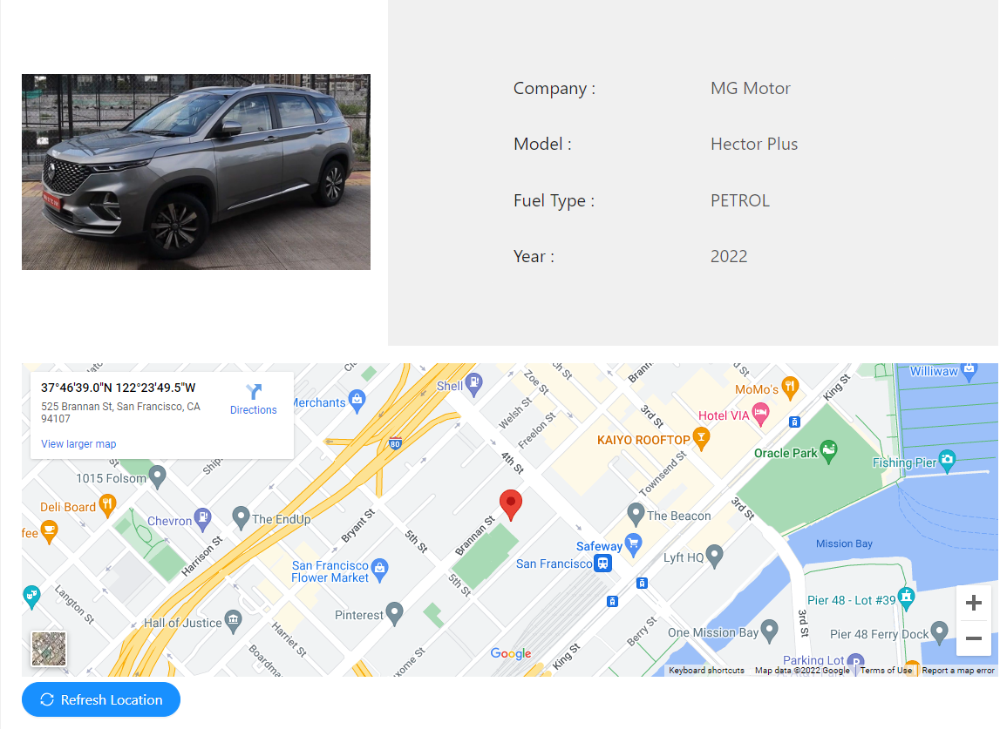

2. Explore the shop

<aside class="positive">Note the ability to purchase an item. Go ahead and purchase something.</aside>

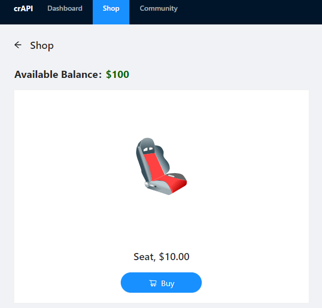

3. Explore the community page

<aside class="positive">Go ahead and add a new comment under an existing post. Also, post a new comment.</aside>

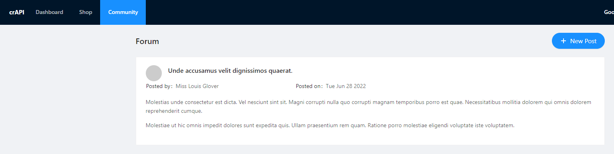

## Explore and Interact with the crAPI APIs

### crAPI APIs

The Completely Ridiculous API (crAPI) service may seem like a simple web service, but like many of today's modern applications it is augmented with a set of API services (endpoints) that receive and provide data that is rendered by the client-side browser. As you've already explored within the Noname system earlier, these are made up of a shop, identity, and community API service. We will explore those API calls through the use of your browser's inspection mode.

1. Navigate to the crAPI dashboard page

2. Right-click anywhere on the page (except for the google map) and select `Inspect`. A new pane is shown either on the bottom or the right-hand side of the browser

3. In the Inspection pane, click on `Network`, followed by `FETCH/XHR` (Chrome) / `XHR` (Firefox)

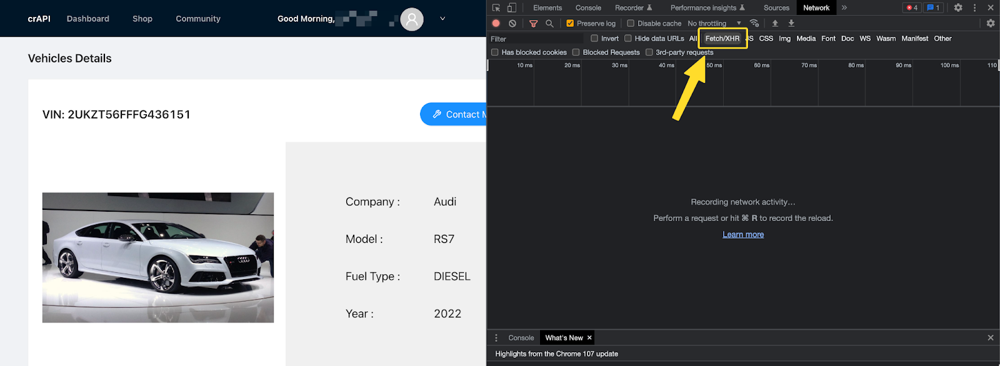

4. Refresh your dashboard page on the left

5. On the right hand pane, click on the `dashboard` item and view the headers and response

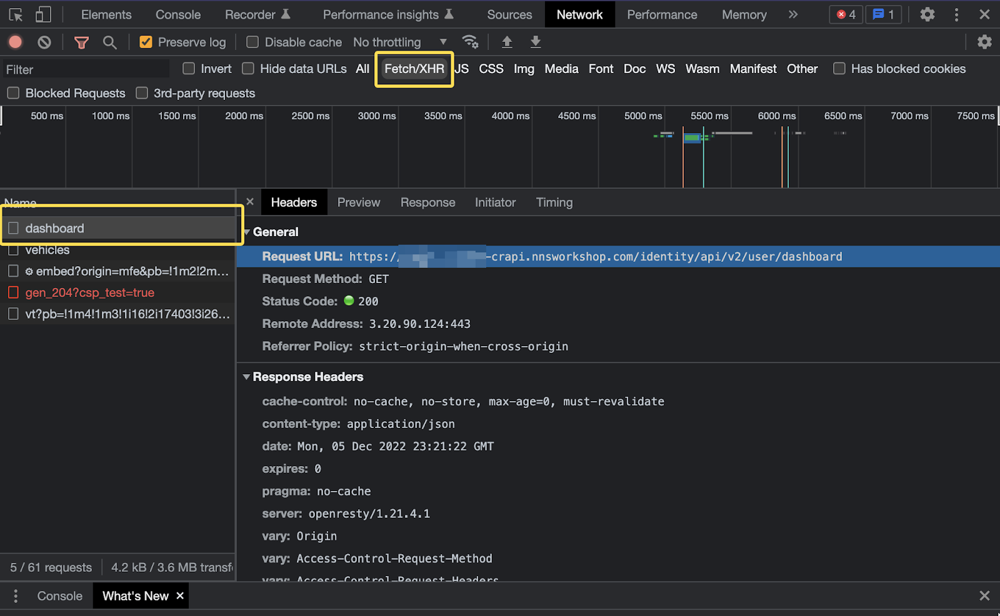

<aside class="positive">Notice that the header contains the URL of the API endpoint. We will use this URL in a later step to access the API directly without having to go through the dashboard web page.</aside>

6. Click on the `Response` page to see the data received from the dashboard API call. Click on the `{ }` brackets on the bottom of that viewing window to render the results in an easily readable format

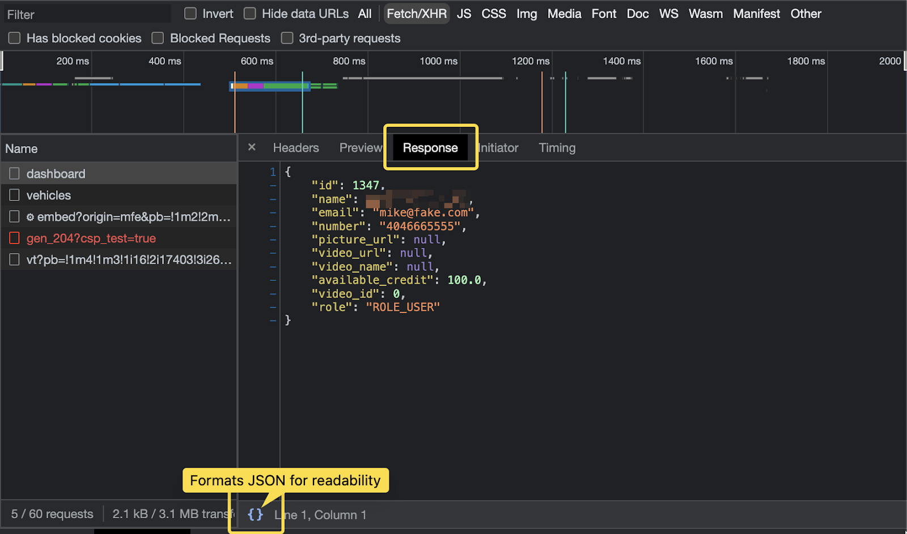

<aside class="positive">See something interesting here? Do you think it is necessary for the API service to respond with all of your user details (phone number, email address, available credit)? One of the OWASP Top 10 API Vulnerabilities is "API3:2019 Excessive Data Exposure". This happens when an API developer decides to query a back-end data resource, in this case fetching your user details from an internal database, and does not filter any fields/values before sending it back to you, the requestor. Sometimes developers rely on the web front-end, in this case the dashboard web page developer, to filter out the fields. Notice how the dashboard webpage does not show this information, even though it is readily available to view in your browser through the `Inspect` panel.</aside>

7. Let's see if we can access the dashboard API URL and get the response data (including sensitive user information) without the use of any authentication (and authorization). Copy the dashboard API URL from the Headers section and paste it into a new browser tab.

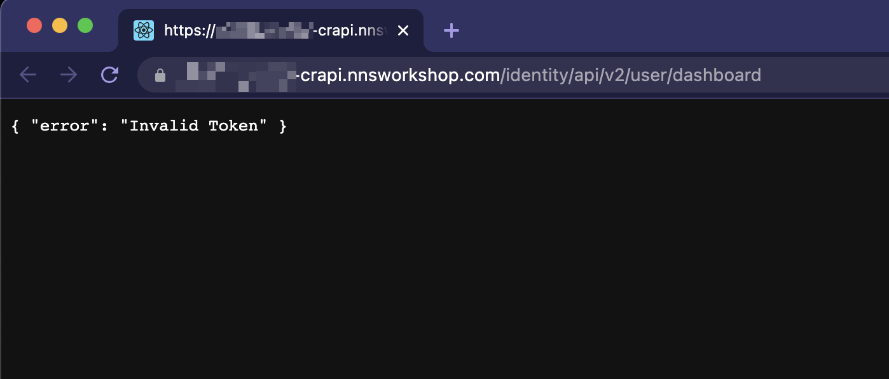

<aside class="positive">Notice that the page will not allow you access to it. This is because you are not authorized to access it because you have not presented your authorization "bearer" token. Let's get that token from our previous page so we can get access to this resource.</aside>

8. Go back to the crAPI dashboard page, and within the `Inspect` pane copy the `Authorization` value from the dashboard API's header page. We will "borrow" this token from this session in order to access the API and request data.

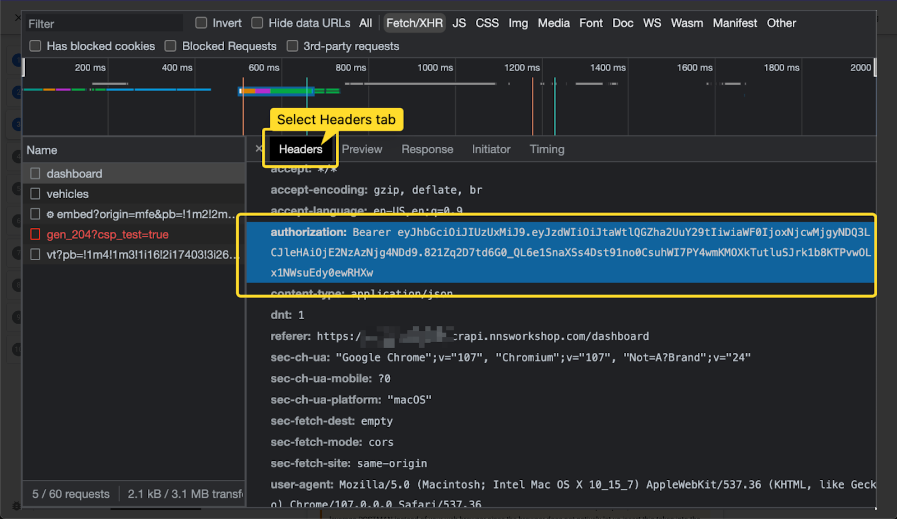

<aside class="positive">Because the authorization bearer token is contained within the header of the web api request, we will need to leverage Postman instead of your web browser since the browser does not natively let us insert this token into the header.</aside>

9. Open Postman and click the `[+]` sign to start a new tab. Keep it as a `GET` request.

10. Paste the dashboard API URL and click on the tab for `Headers` and create a new one called `Authorization` and paste the value of the bearer token there. Hit `Send`.
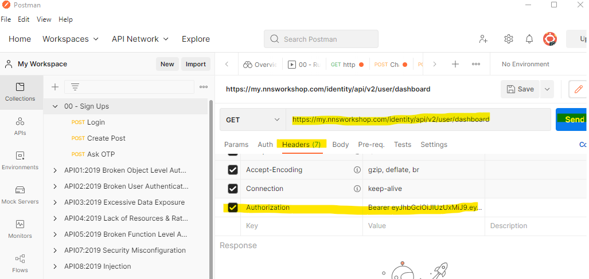

11. Click on `Body` and see the results of the API request. You have successfully accessed the API and received data back.
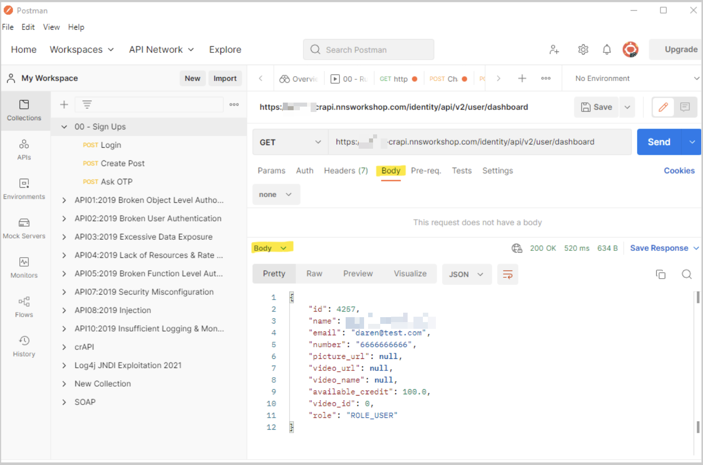

<aside class="positive">With a bearer token you were able to retrieve your user information which is associated with your token (at least for the duration of that token being valid). You are `Authorized` to view your data so long as you provide that (ephermeral) token that is assigned to you.</aside>

12. Explore what other API calls occur when you click around the Dashboard page. Specifically, click on the `Refresh Location` beneath the map.

<aside class="positive">Note the new API resource that popped up in the Inspect pane called `location`</aside>

13. Explore the `location` API service by clicking on it
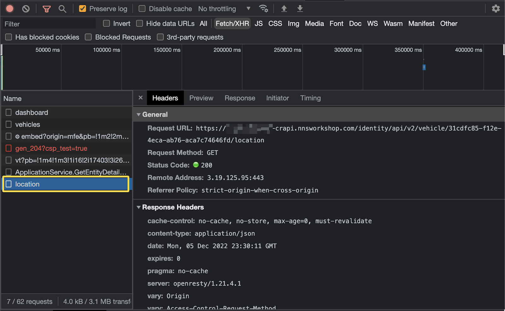

<aside class="positive">Notice that the location URL contains a unique identifier (carID). This is a complex hash (uuidv4) that would be very difficult to guess or even iterate through. This must be known, somehow. This ID is part of the API URL and a unique aspect of APIs that differentiates them from web page URLs. It is referred to as a uri parameter and must be provided in order to access a vehicle's location.</aside>

14. Click on the `Response` tab for the location API

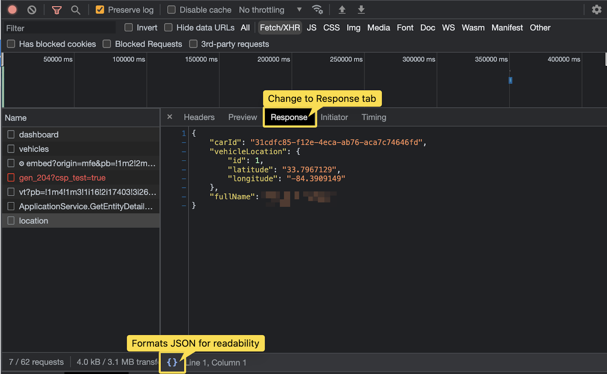

<aside class="positive">Notice the latitude and longitude of the vehicle?

Did you also notice the full name in the API response? This is another example of excessive data exposure. Is the full name really necessary to map the location of the car? No.

Also, there is NO userID tying the carID to you as a user, other than the bearer token that was provided. Business logic will be needed to tie a token back to a user, to a car. You can understand now why it is difficult for a WAF or API Gateway to figure out whether this LOCATION query is authorized for this bearer/user and for this vehicle.</aside>

## Attack the crAPI Service with a BOLA

At this point we've learned a lot about the Location API service: 

* The URL requires a carID parameter that cannot be guessed and is unique to each user+vehicle
* When called with a real carID parameter, the API returns the geo-location of the vehicle.

A request to the API URL at:

`https://customer.nnsworkshop.com/identity/api/v2/vehicle/{CAR_ID}/location`

Returns:

```json
{
  "carId": "{CAR ID}",
  "vehicleLocation": {
    "id": 3,
    "latitude": "{SOME LATITUDE}",
    "longitude": "{SOME LONGITUDE}"
  },
  "fullName": "{SOMEONE'S FULL NAME}"
}
```

Now let's go hunting for some carIDs associated with other users so that we can access their vehicle's location, even if we are not authorized to view it (BOLA). If we're lucky, the excessive data exposure we are seeing throughout this web+API application will leak something for us to use.

1. Click on the `Contact Mechanic` button. Anything related to carID's in the API responses there?

<aside class="positive">Notice the list of all mechanic's email addresses in the MECHANIC/ API endpoint (response data)? Another example of excessive data exposure perhaps?

HINT: If the list of APIs gets long, and you want to see what APIs are only associated with the CONTACT MECHANIC button, click your browser's REFRESH button after clicking on the CONTACT MECHANIC - or any other page, to clear the list of APIs and start fresh.</aside>

2. Click on the `Shop`. Look at the APIs and their response data. Any leaky carID's there?

3. Click on `Community` and then select the `recent` API in inspector. See anything? BINGO
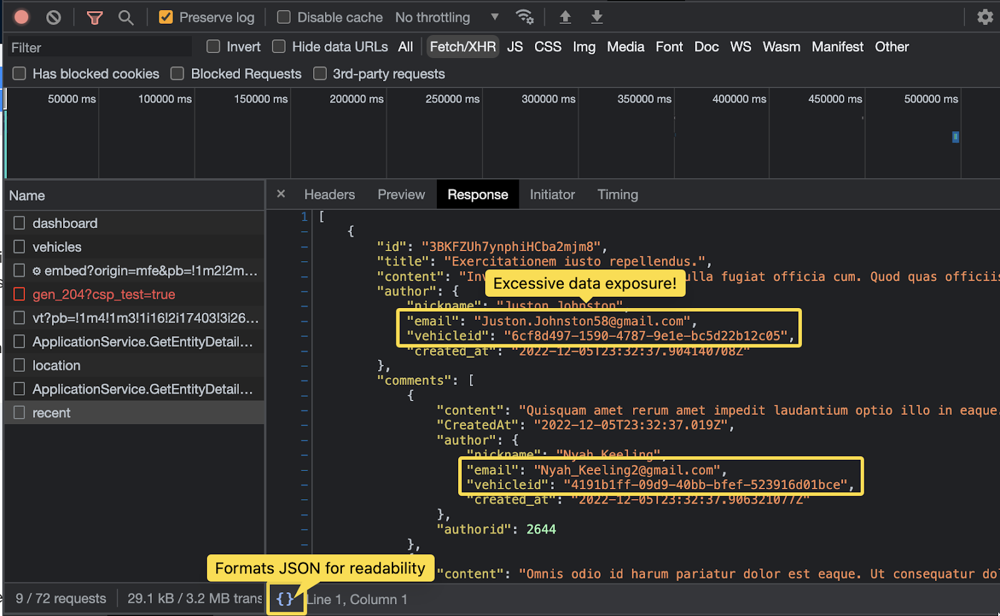

<aside class="positive">Congratulations! You've uncovered a "Leaky" API that is providing you with vehicle/car IDs that are not associated with you. Is there any reason that the COMMENTS data should include the Car/Vehicle ID?

_Notice that there's also some EMAIL fields here as well - signaling excess data exposure._

One of the first lines of defense against leaky API data like this, is an API that conforms to its documented specifications. View the /community/api/v2/community/posts/recents entry within Noname and look at the API Specification field. _Note that it shows a DIFF which indicates that the specification for this API was not followed because it responded with fields that were not required for this service to operate._</aside>

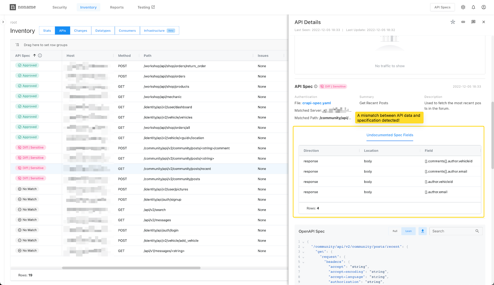

<aside class="positive">Let's check to see if we can access the location of one of the vehicles that is not ours, while using our own bearer token.</aside>

4. Since we have to conduct a test using our authorization bearer token, let's go back to Postman and the original `GET` tab we used for the dashboard in the previous activity.

5. Copy the URL from the `location` API header field from within your inspection pane in your browser. Paste this URL into Postman and leave it as a `GET` request.
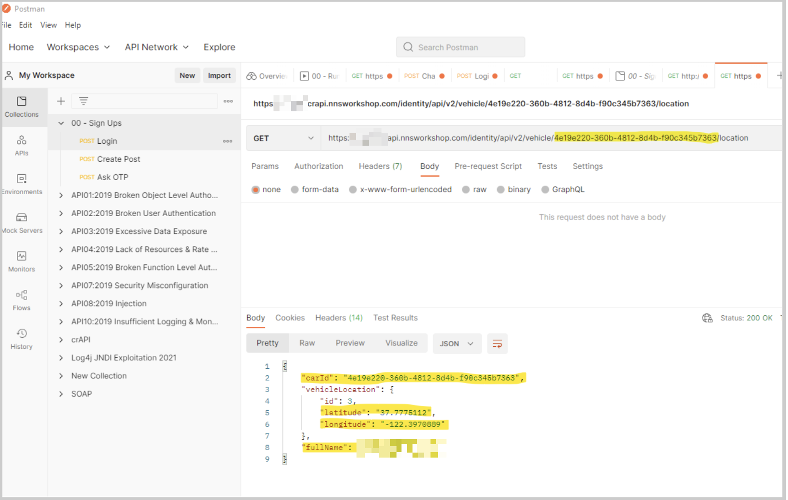

6. Replace the `car_id` parameter in the location URL with another user's `car_id`. Keep in mind that you will still be using your own authorization bearer token as you make this request.
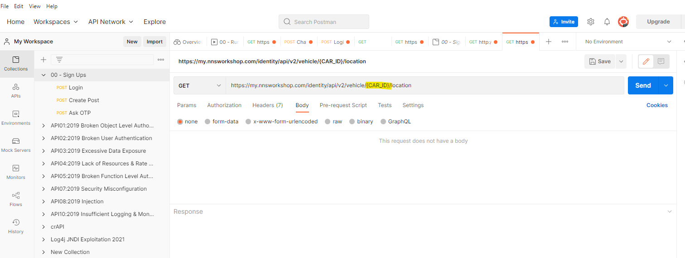

<aside class="positive">What was the result of your request to this API, with another user's car ID as the parameter, but your own authorization token for access?</aside>

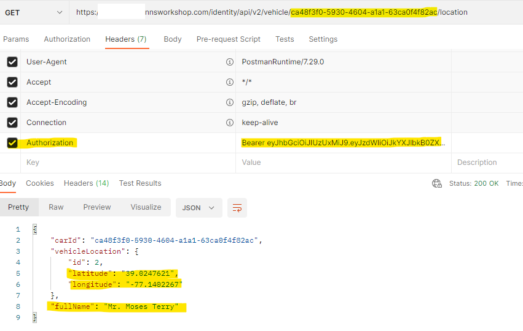

<aside class="negative">This flaw in business logic is known as a BROKEN OBJECT LEVEL AUTHORIZATION or BOLA and is the OWASP API Top 10's number one vulnerability as seen in the wild today.</aside>

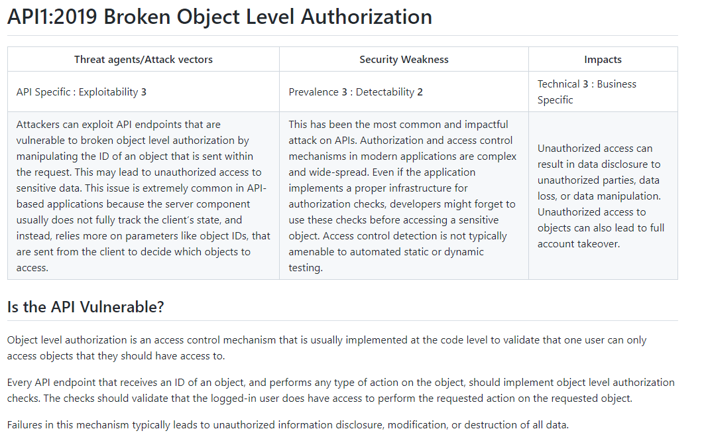
_Reference: [https://github.com/OWASP/API-Security/blob/master/2019/en/src/0xa1-broken-object-level-authorization.md](https://github.com/OWASP/API-Security/blob/master/2019/en/src/0xa1-broken-object-level-authorization.md)_

<aside class="positive">Why are BOLAs so difficult to detect?

BOLAs happen because of a flaw in business logic. BOLAs involve a mismatch of user authorization to the resource it is accessing. In order to detect a BOLA, you must be able to understand what parts of an API URL are the endpoint service itself, and what are parameters. You also must be able to model behavior to understand what users are accessing what objects (in this case you with your authorization token and your car ID), and if it is a one-to-one, one-to-many, or many-to-many relationship.</aside>

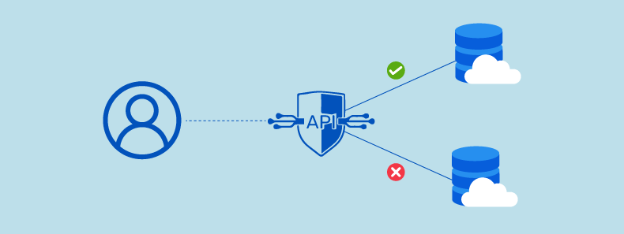

A "Leaky" API along with the BOLA vulnerability allowed us to access the location information of someone else's vehicle. Let's look at real-world examples of how Leaky APIs have caused havoc for high-profile companies and individuals.

**May 2021: Peloton's leaky API let anyone grab riders' private account data**

[https://techcrunch.com/2021/05/05/peloton-bug-account-data-leak/](https://techcrunch.com/2021/05/05/peloton-bug-account-data-leak/)

Let's look at real-world examples of how leaky API geo-location data can be used as a "tracker".

**Jan 2022: A 19-year-old built a flight-tracking Twitter bot.**

[https://www.protocol.com/elon-musk-flight-tracker](https://www.protocol.com/elon-musk-flight-tracker)

**May 2022: Teen tracking Elon Musk's jet says he's found Mark Zuckerberg's plane**

[https://nypost.com/2022/05/19/teen-tracking-elon-musks-jet-says-hes-found-mark-zuckerbergs/](https://nypost.com/2022/05/19/teen-tracking-elon-musks-jet-says-hes-found-mark-zuckerbergs/)

## Automating the BOLA Attack

1. Log into the crAPI service using a Postman script by clicking on `00-Sign Ups and Login` and clicking `Send` on the `Login` request. This will allow you to receive a new Authorization Bearer Token that will be automatically populated as an environmental variable within the globals section and can then be used by the BOLA automation scripts.
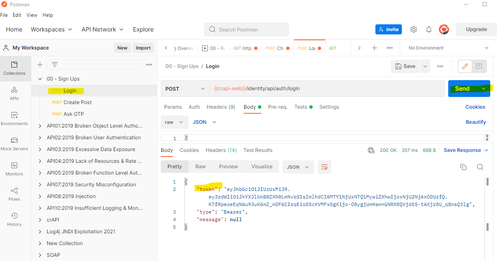
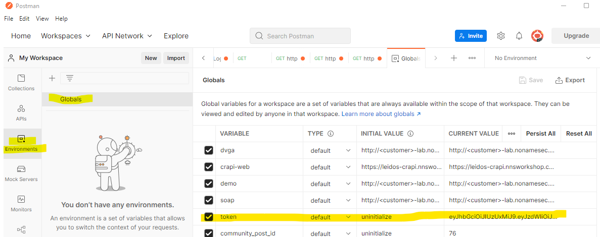

2. Expand the `API01:2019 Broken Object Level Authorization` folder and click on `Get Vehicle IDs`. Click on the `Console` button at the bottom of the Postman screen to open up your bottom console screen. Click on `Tests` to view the script.
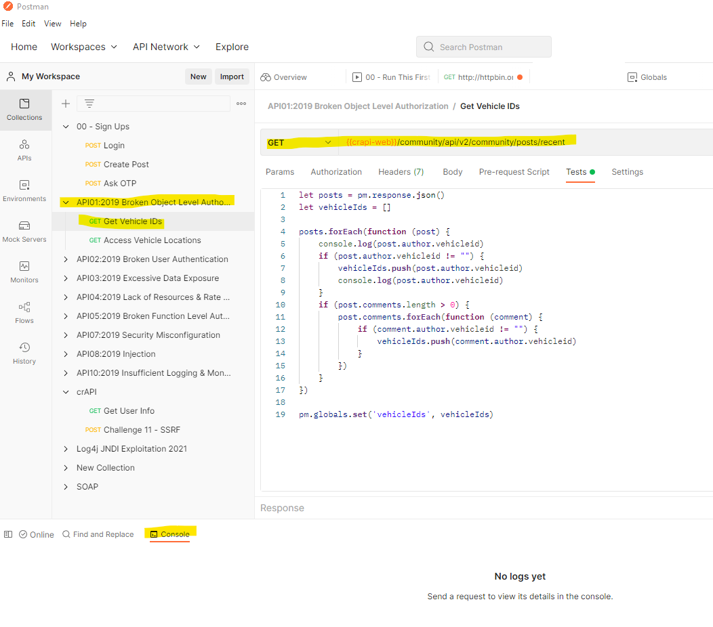

<aside class="positive">What is this postman automation script doing?

This script essentially does what we did earlier, it accesses the community forum data through its corresponding API and gets back a list of forum postings that includes vehicle IDs. It then loops through each post and extracts the vehicle ID for later use. Remember this ID can be used later as a URL Parameter to the Dashboard's LOCATION URL for accessing geo-location data for this vehicle.</aside>

3. Click on the three buttons `***` next to the API01 collection on the right hand side of it's entry in the tree view, then select `Run Collection` and click on the `Run` button.
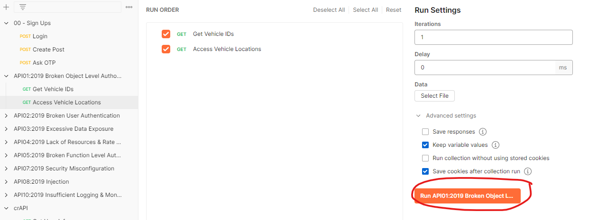

4. View your console output, and scroll down to the bottom to view all of the dashboard+location URLs with VehicleID parameters auto-populated. Expand one of the entries to view the response body which successfully retrieved the location data.
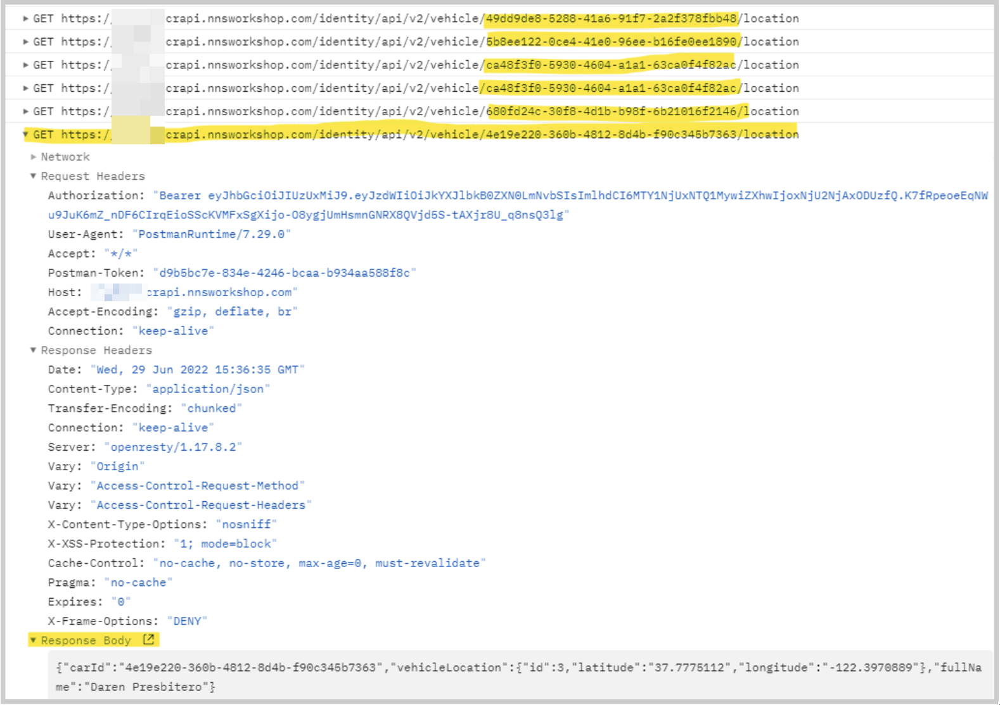

## View the BOLA Detection in Noname

1. Log into the Noname platform

2. Click on `Issues` and look for the `Internet-Facing API with Broken Object Level Authorization`
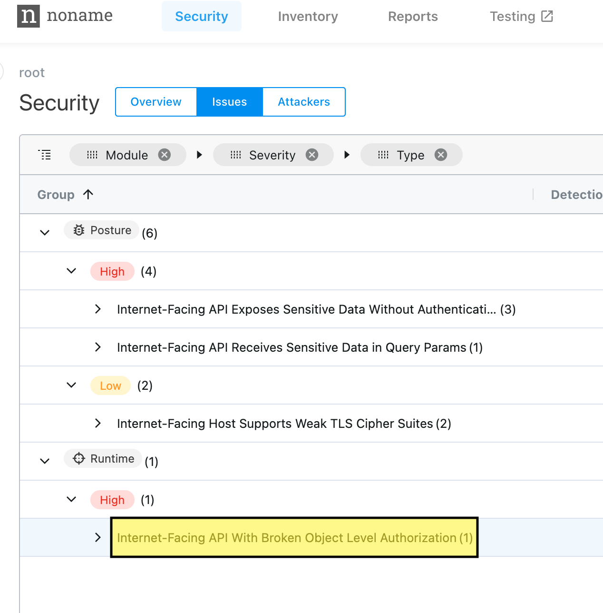

3. Expand the issue and click on it to view the details
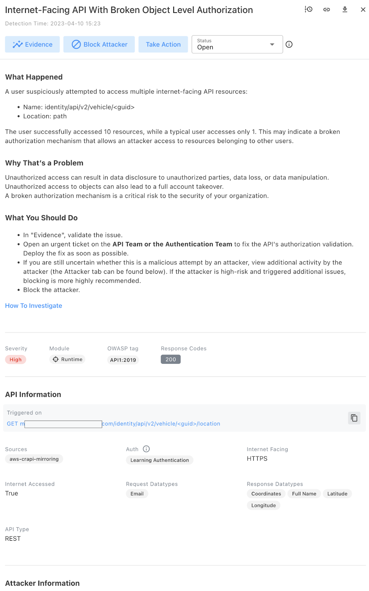

<aside class="positive">Click `How To Investigate` to see what the remediation process can look like.</aside>

4. View the `Evidence` and look at the timeline of events that show the user's activity including what resources were accessed before and during the event in question.
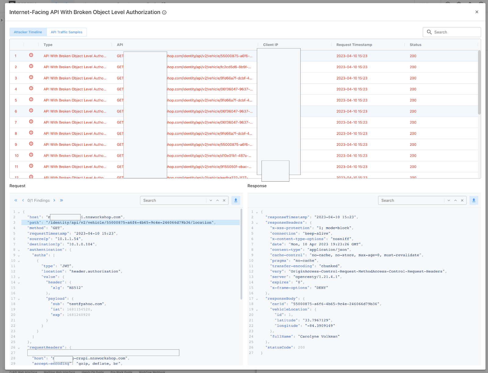

<aside class="positive">This view is typically consumed by SOC personnel investigating alerts, and forensics personnel involved in incident response.</aside>

5. Click on `Block Attacker`. You can easily block the attacker from this page, but since this is a workshop that may contain many BOLAs from many students, let's find your specific user/IP to block instead. Click on the `Attackers` tab.

6. Find your user email on the `Attackers` page and click on `Block Attacker`, then click on the IP address and SAVE. The Noname platform will now instruct the AWS WAF to block your IP address.

<aside class="positive">The Noname platform can automate the creation of block rules for many devices within an environment, including WAFs, Load Balancers, API Gateways, CSP infrastructure components, etc. with each having its own set of unique indicators for blocking (IP, JWT, Header info). The device type will determine the indicator that is supported for the block, and in this case the LB supports IP address blocks.</aside>

7. Try to issue another Postman request to the crAPI service in order to test the blocking. You can wait 5 minutes (default) to access the crAPI service since the block rule is on a timer (user adjustable during block initiation)

8. Another ML-detected issue aligns with excessive API use (or abuse). The ML has determined that there is an unusual spike in API calls from a user, probably because this API supports a front-end web app that users interact with and would not normally bombard the way your script did. *This can be an indicator of someone performing a data scrape or possible fuzzing.*
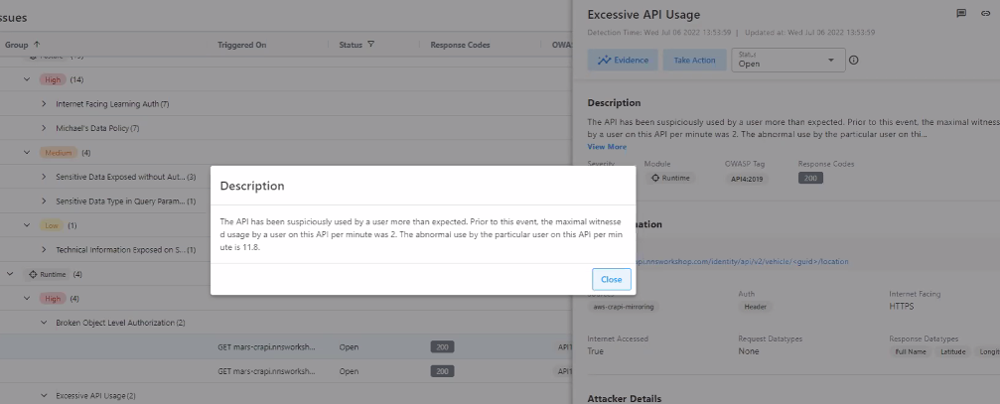

## Classify Data and Trigger a DLP Violation

1. In Postman, click on the `00-Sign Ups collection` and select `Create post`

2. Click on the `Body` section

3. Using the REGEX VALUE word that you created in the first activity enter it under the `Content` section of the API request payload.

4. Hit `Send`.
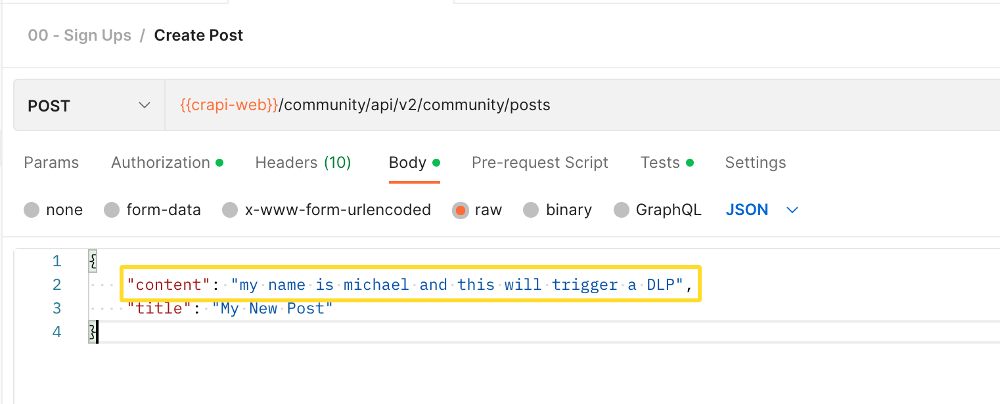

<aside class="positive">The image above shows the new Datatype and value that was defined within the Noname platform in the first activity. We will send a value that aligns with this datatype so that:
* The data will be identified, inventoried, and associated with the API
* A DLP policy will alert administrators to an issue.</aside>

5. Go to the Noname home page (click the noname icon in the top left) and click on `Inventory`, then click on the `Datatypes` tab.. Do you notice your datatype showing up? Click on your datatype to see the APIs associated with that data.

6. Click on `Issues`. Do you see the `Data Policy Violation`?

7. Edit the payload in Postman and enter a new key:value using any key name and value you want. Be sure to enter a comma `,` after the title line as you do this. This is also known as PARAMETER TAMPERING as was seen with Log4j and Spring4Shell.
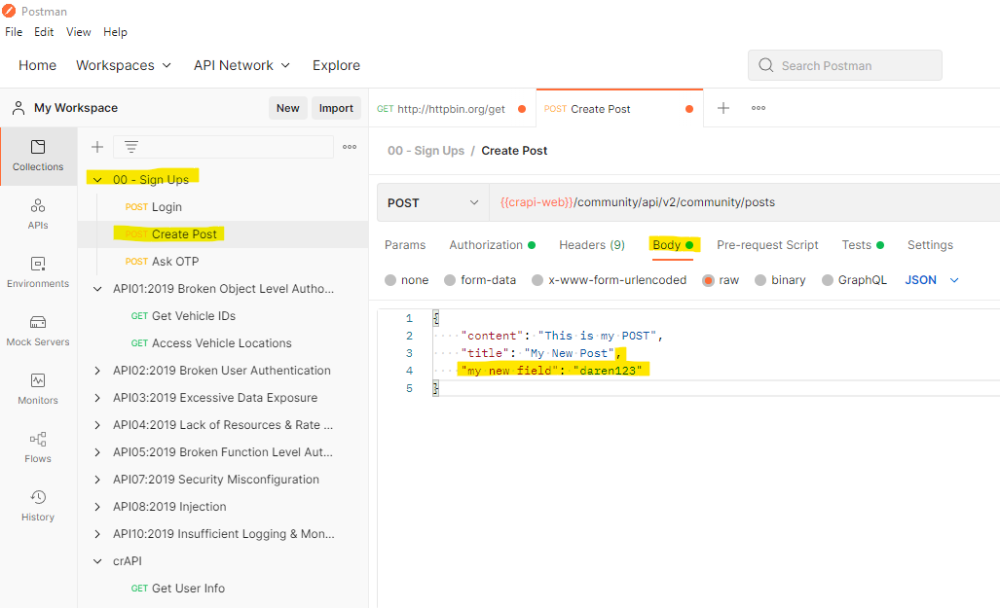

8. Wait a few moments and refresh the page, you should now see a new issue called "Internet-Facing API Access with Unexpected Request Field"
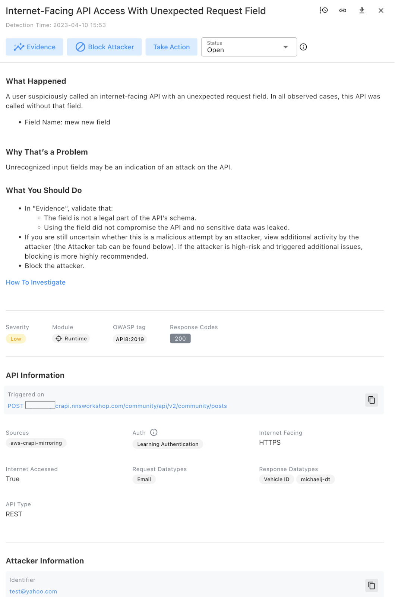

<aside class="positive">
We will see an issue arise within the Noname platform showing that the API has an **unexpected request field**.

You'll notice that the API specification shows no flagged deltas/diffs as part of this new field.

Why is that? It's because we haven't noticed enough unique user requests for this field. Imagine what would happen if this user were to "fuzz" the API with various field names - we'd get a huge list of diff entries and a lot of noise around that.

Another thing to note: Unexpected request fields are not captured under the datatype section even if there is a match on the value. This is because the ML determines that only a single user and/or transaction was seen with this field and it is outside of what the normal schema looks like (even if it is outside of the API specification) thus this is an abnormal call so the datatype match is disregarded. Again, this would introduce a lot of noise were it not the case.
</aside>

## Active Testing

The Noname active testing module helps developers automate security testing, right in the pipelines they are already leveraging for tasks such as unit/integration testing. This "shift left" into the software development lifecycle helps ensure issues never make it into production.

<aside class="negative">Note: Each user following along should do so as a new application, not using the default app</aside>

1. Before we head to active testing, we need a specification for our API! Download the specification here: [https://customer.nnsworkshop.com/crapi-spec.json](https://customer.nnsworkshop.com/crapi-spec.json)

2. Navigate to Active Testing by clicking `Testing` at the top of the Noname dashboard.
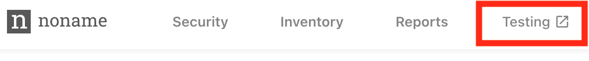

3. As no applications have been set up, we are presented with a "+ New Application" button, or the option to create a Vulnerability Lab. Click the "+ New Application" button!
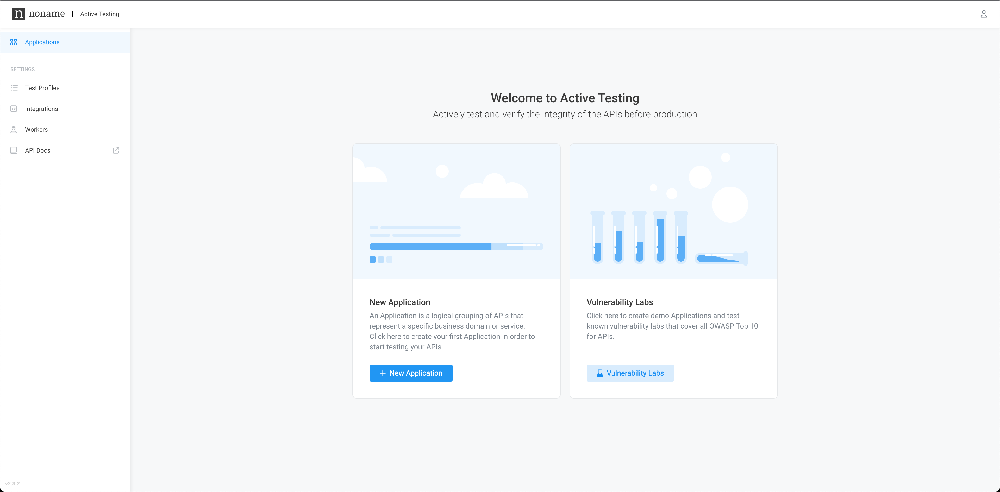

4. Set the application name to `crAPI - <YOUR NAME>`, and the base URL to `https://customer-crapi.nnsworkshop.com` and click Next.
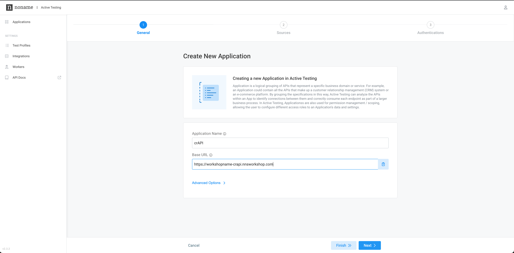

5. The scanner needs to know the functional requirements of the API. In order to discover this, we will add an Open API specification as a Source. Select the Open API spec downloaded earlier. Set the source name to crAPI.
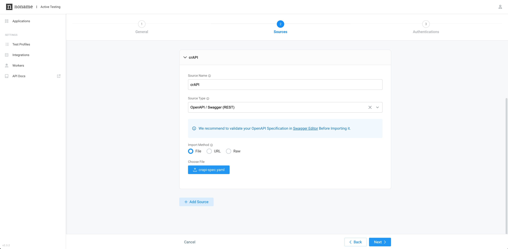

### Now that we have added the source, we need to set up the authentication profiles for the scanner. Authentication is necessary in order to do more intelligent testing of the API. In order to provide authentication, for the API, we will utilize postman collections to generate tokens for Jane Doe and John Smith.

### The first authentication profile we will add is "Jane Doe". 

1. Set the name to `Jane Doe`, and set the role to `Reader / Writer`. 

2. In the secrets section, change the `Secret Type` to `Postman Collection`.

3. Download the postman collection for Jane Doe by clicking here: [https://customer.nnsworkshop.com/janeDoe.postman_collection.json](https://customer.nnsworkshop.com/janeDoe.postman_collection.json)

4. Upload the file to the `Collection File` section.

3. Change the Source Part to `Body`

4. Change the JSON Path to `$.token`.

5. Change the `Add Secret To` to `Header`

6. Set the `Header Key` to `Authorization` 

7. Set the `Header Value Template` to `Bearer {}`.

### Now we will add the "John Smith" authentication profile


1. Click `+ Add Auth`

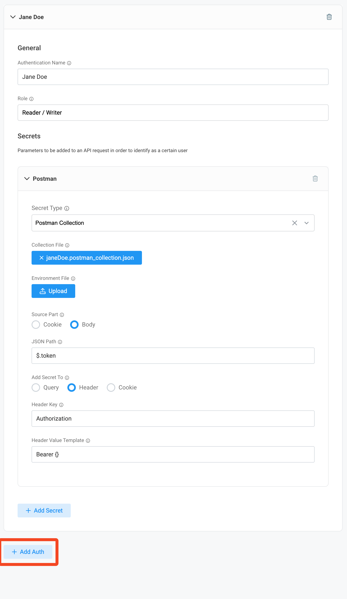


2. Set the name to `John Smith`, and set the role to `Reader / Writer`. 

3. In the secrets section, change the `Secret Type` to `Postman Collection`. 

4. Download the postman collection for John Smith by clicking here: [https://customer.nnsworkshop.com/johnSmith.postman_collection.json](https://customer.nnsworkshop.com/johnSmith.postman_collection.json)

5. Upload the file to the `Collection File` section.

6. Change the Source Part to `Body`

7. Change the JSON Path to `$.token`.

8. Change the `Add Secret To` to `Header`

9. Set the `Header Key` to `Authorization` 

10. Set the `Header Value Template` to `Bearer {}`.


#### Now that the application has been set up, click "Scan" to initiate the first scan!

After the first scan has completed, you will notice that the tool has flagged 4 APIs as unreachable. This indicates that the tool was not able to automatically determine how to properly interact with the APIs. This is important; in order to properly test for security, you have to know how to successfully interact with the endpoints, otherwise, you will see failures related not to security issues but to general usage issues.

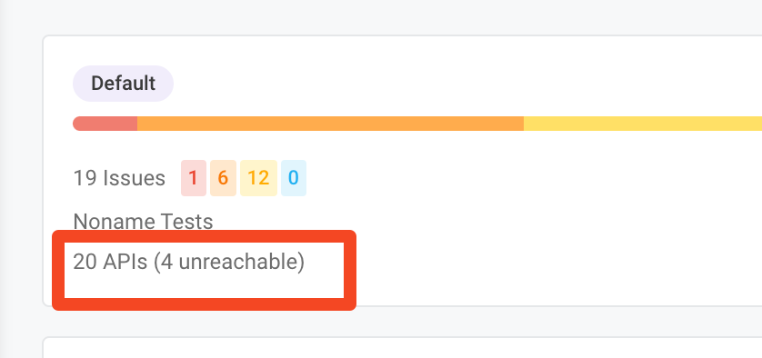

### Resolve Vehicle Location Dependency

1. Navigate to the inventory tab.
2. Click on the endpoint `GET /identity/api/v2/vehicle/{vehicleId}/location`.

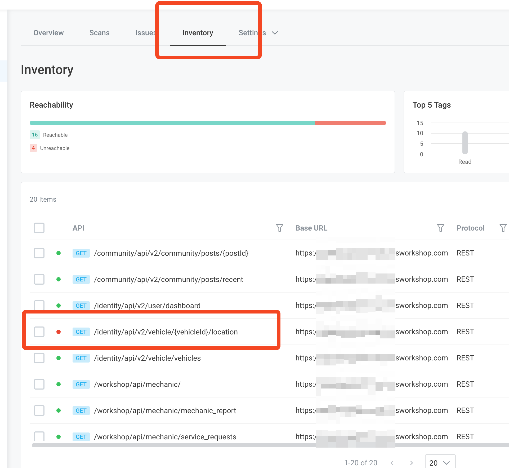
3. Now that we are in the request editor, scroll down to the `URL Params` and notice that the `vehicleId` param has mapped to the wrong dependency.
4. Click on the row for `vehicleId` and change the `API` field to `GET /identity/api/v2/vehicle/vehicles`. This tells Active Testing to make a GET request to this endpoint, which returns all of the user's vehicles, as a dependency.
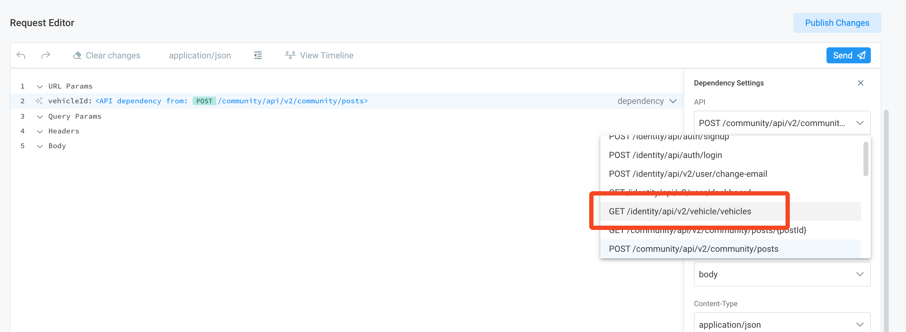
5. Next, change the field `Path` to `0.uuid`; this tells Active Testing to use the field `uuid` from the first item returned in the array, which `GET vehicle/vehicles` returns.
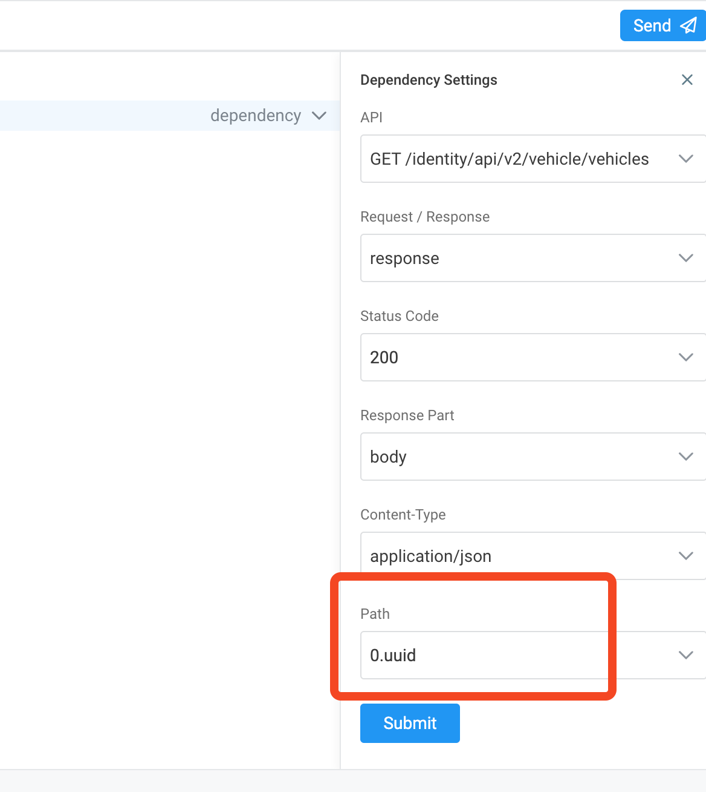
6. Click `Submit` to save the change.
7. Click `Publish Changes` to save the change.
8. Navigate back to the inventory page and check the reachability of the location endpoint again.
9. Click on the now green dot to see how Active Testing has validated reachability.
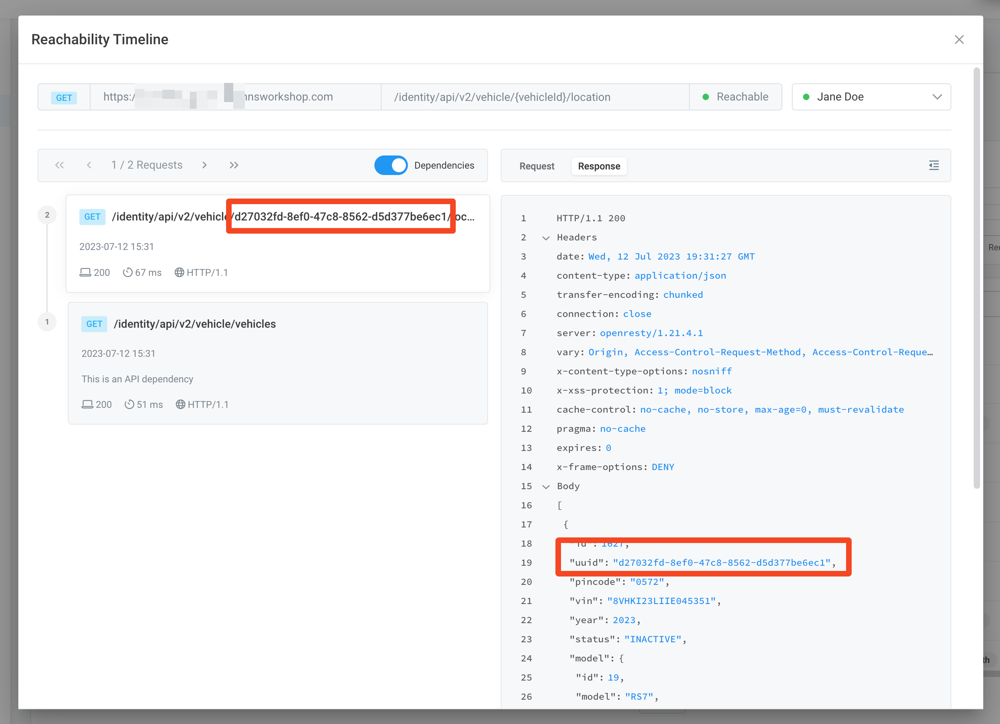


### Resolve Create Order Reachability

1. Navigate to the inventory tab.
2. Click on the endpoint `POST /workshop/api/shop/orders`.

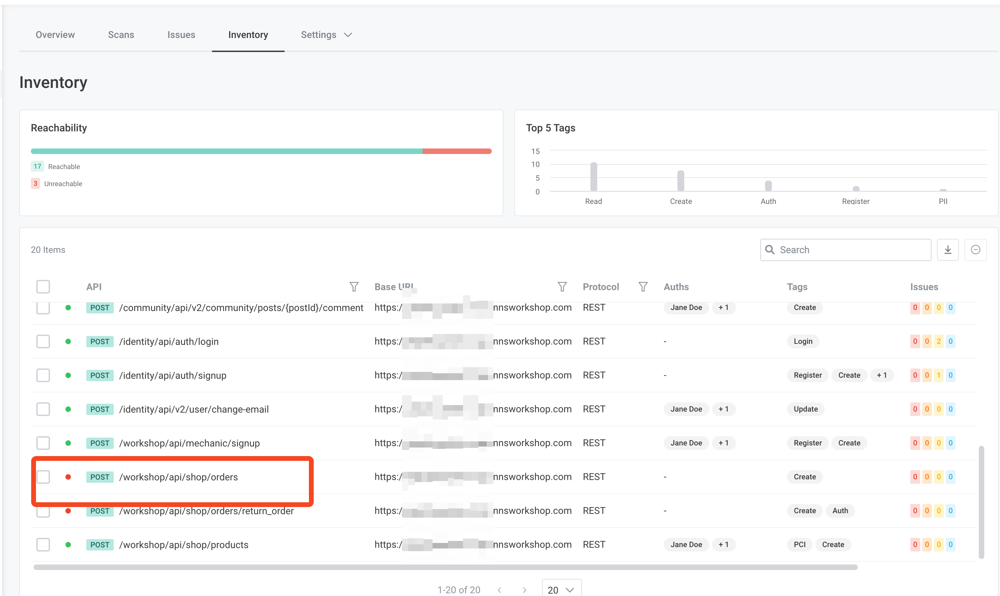
3. Now that we are in the request editor, scroll down to the `Body` and notice that the `product_id` value has mapped to the wrong dependency.
4. Click on the row for `product_id` and change the `API` field to `GET /workshop/api/shop/products`. This tells Active Testing to make a GET request to this endpoint, which returns all of the available products, as a dependency.
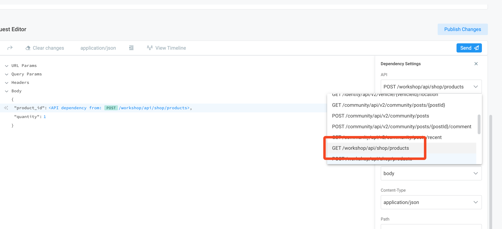
5. Next, change the field `Path` to `products.0.id`; this tells Active Testing to use the field `id` from the first item returned in the products array, which `GET shop/products` returns.
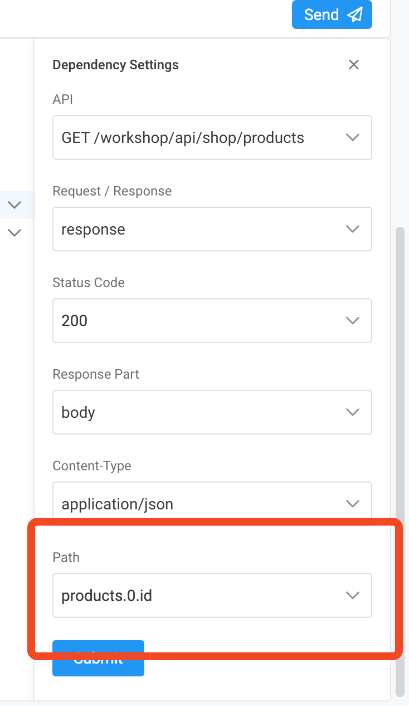
6. Click `Submit` to save the change.
7. Click `Publish Changes` to save the change.
8. Navigate back to the inventory page and check the reachability of the POST shop/orders endpoint again.
9. Click on the now green dot to see how Active Testing has validated reachability.
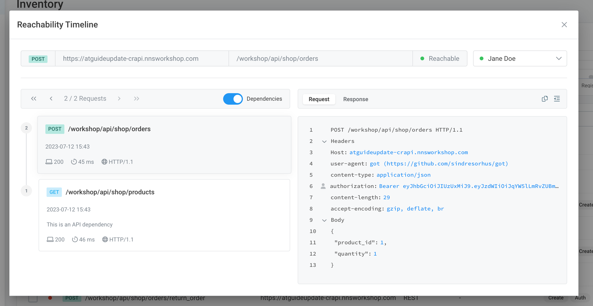

### Check Get Order by ID Reachability Again

1. On the inventory page, run the reachability check for `/workshop/api/shop/orders/{order_id}` again. You will notice that the reachability is successful this time. Now that we have resolved the dependency issues for create order, the automatically mapped dependency for retrieving a specific order is also resolved.

### Fix Reachability for Return Order

1. Challenge! See if you can fix the reachability for the return order API yourself!

### Run another scan

Now that we have resolved the reachability issues, the scan returns new issues! Explore the issues with your workshop leader.

## What's Next?

[Noname Blog](https://nonamesecurity.com/blog)

[Active Testing](https://nonamesecurity.com/active-testing)

[Resources](https://nonamesecurity.com/resources)

[Noname Learning Academy](https://nonamesecurity.com/learn)

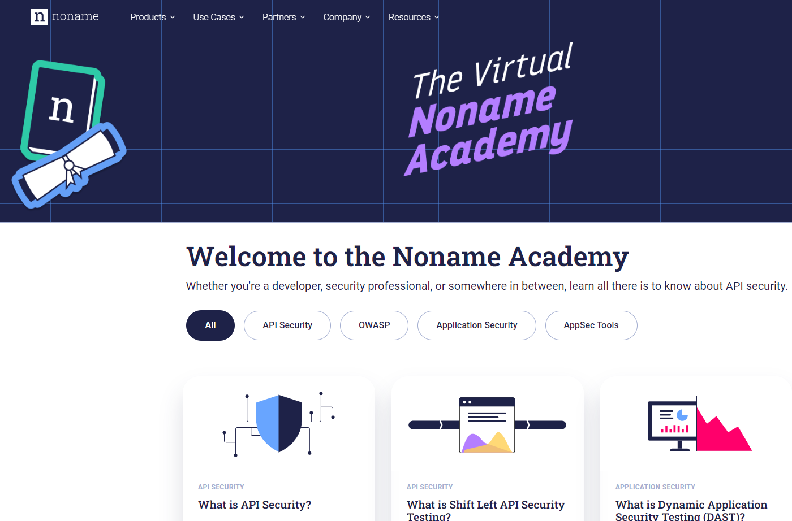