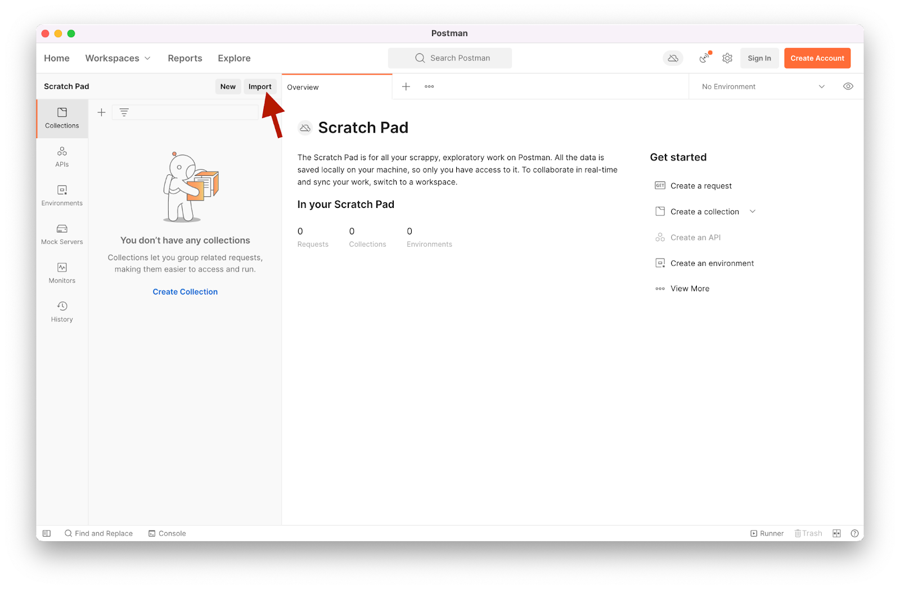

author: Michael Jones
summary: This Workshop walks you through the Noname API Security Workshop in a hands-on, guided way.
id: prework
categories: workshop
environments: web
status: published
feedback link: https://forms.gle/bHiu6PEi4Cf1A35x9

# Noname API Security Workshop - PreWork

## Introduction

This Workshop is for technical professionals and managers who are interested in learning what Application Programming Interfaces (APIs) are and understand the risks associated with APIs. Attendees will get hands-on experience with techniques that are used to exploit vulnerable APIs resulting in unintended data exposure.

This Workshop will also look at the actual traffic and how it is analyzed and viewed within the Noname Platform through the use of its posture management and runtime protection.

### Aproximate Duration:

Three to four hours, depending on the size of the group

### Objectives

At the end of this Workshop, participants should be able to:

* Explain what APIs are and why securing APIs is important
* Understand the OWASP API Top10 and the associated security risk around the number one vulnerability to APIs - Broken Object Level Authorization (BOLA)
* Explain what Detect, Analyze, Remediate, and Test is (D.A.R.T)
* Explain what the Noname Platform is and the integrations that support posture management/discovery and runtime protection/anomaly
* Review and understand API vulnerabilities and corresponding threats on the Noname Dashboard
* Understand DataType tagging and its importance in discovery and security risk detection
* Automating issue detection, Issue comprehension and remediation strategies
* Policy creation and its importance in automating the remediation process
* The reporting capabilities of the Noname Platform

### Audience

Developers, DevOps, SecDevOps, or any other technical professional interested in learning what APIs are and their use in the real world, and what the D.A.R.T. strategy is and the tools that realize the strategy.

### Prerequisites

* Access to a browser and the ability to access internet sites external to the organization
* Access to Zoom or MS Teams for live instructor follow-along
* Access to Postman, installation link: https://www.postman.com/downloads/

## Validate Noname Account

Each Workshop participant will have their own unique login to the Noname platform.

1. Navigate to [`https://customer.nnsworkshop.com`](https://customer.nnsworkshop.com)
2. Enter your email address
3. Your password for this Workshop is: `admin_password`

## Register for crAPI

<aside class="negative">
Please do not use an actual email address or phone number! This application has been deliberately designed with some of the top vulnerabilities APIs face.
</aside>

During this Workshop, we will be using a web application created by the OWASP organization. This web application is powered by APIs with vulnerabilities that we have been challenged to discover and exploit!

OWASP API Top 10 Vulnerabilities: [https://owasp.org/www-project-api-security/](https://owasp.org/www-project-api-security/)

Completely Ridiculous API (crAPI): [https://github.com/owasp/crapi](https://github.com/owasp/crapi)

Challenges: [https://github.com/OWASP/crAPI/blob/develop/docs/challenges.md](https://github.com/OWASP/crAPI/blob/develop/docs/challenges.md)

1. Navigate to your crAPI instance: [https://customer-crapi.nnsworkshop.com](https://customer-crapi.nnsworkshop.com)

2. Click Signup in the top right

3. Enter your information

4. After registering, sign in

5. Click `+ Add a Vehicle`

6. Navigate to your mailhog instance: [https://customer-mailhog.nnsworkhsop.com](https://customer-mailhog.nnsworkshop.com)

7. Find the "email" that matches the address you registered with

8. Register using the VIN and pin code provided in the mailhog email
Negative
: Note! The VIN and Pin Code are in the opposite order in the email

## Set Postman Up

### Installation

<button>[Download Postman](https://www.postman.com/downloads/)</button>

1. Install Postman
2. Open Postman
3. You will be prompted to create an account or sign in. Rather than doing that, click "Skip and go to the app"

### Import Collection

<aside class="negative">
If you are signed into Postman and were previously using Postman, we recommend that you create a new workspace specifically for this Workshop to help separate out the collections
</aside>

1. Download the Postman collection zip file: [`https://customer.nnsworkshop.com/postman-collection`](https://customer.nnsworkshop.com/postman-collection)

2. In Postman, click import

3. Click `Upload Files` and navigate to the folder you extracted from the zip file

4. Select all of the files and import

5. Navigate to the Environments tab

6. Click on Globals

7. Validate that the URL matches your crAPI url: `https://customer-crapi.nnsworkshop.com` Make sure you are doing this in the column called Current Value.

8. Replace `SET EMAIL AFTER REGISTERING` with the fake email adddress that you registered with crAPI (both columns)

9. Replace `SET PASSWORD AFTER REGISTERING` with the password y ou registered with crAPI (both columns)

10. Save your changes!

<aside class="positive">
You are ready to go for the Workshop! If you have any issues or questions please reach out to your Workshop coordinator at Noname!
</aside>